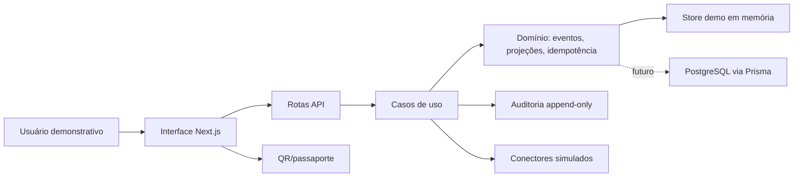

# Arquitetura

Monólito modular em Next.js App Router.

## Camadas

- Interface: páginas, scanner, formulários, dashboard.
- Aplicação: autorização, validação, orquestração.
- Domínio: entidades, eventos, projeções, divergências.
- Infraestrutura: Auth.js, Prisma, PostgreSQL, scripts, CI.
- Projeções: estado consolidado, métricas, linha do tempo.
- Cognitiva futura: contratos somente leitura em `src/modules/cognitive/contracts.ts`.
