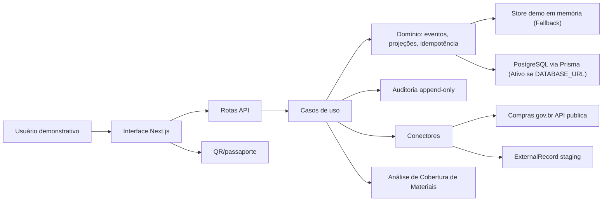

# Arquitetura

Monólito modular em Next.js App Router.

## Camadas

- Interface: páginas, scanner, formulários, dashboard, jornada de cobertura.
- Aplicação: autorização, validação, orquestração, rotas de análise `/api/v1/material-analyses`.
- Domínio: entidades, eventos, projeções, divergências, fórmula de déficit determinístico.
- Infraestrutura: Auth.js, Prisma, PostgreSQL (Neon/Local), scripts, CI.
- Projeções: estado consolidado, métricas, linha do tempo.
- Conector Compras.gov.br: cliente HTTP isolado, timeout, retry, cache, validacao Zod, staging, normalizacao canonica, e rastro de execução técnico.
- Cognitiva: análise determinística de atas e cálculo de confiança (sem LLM).

