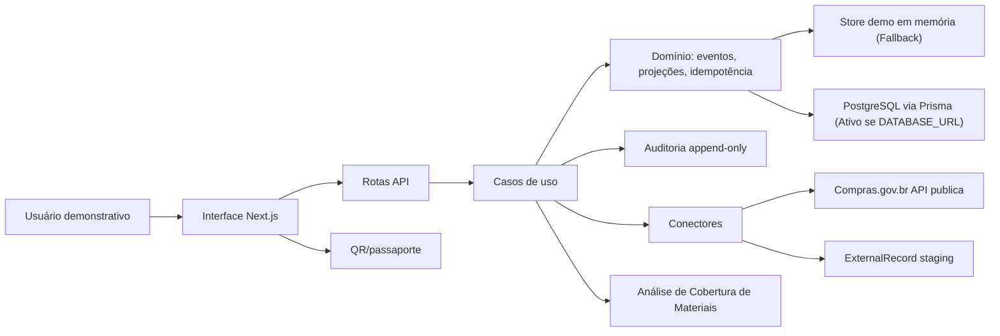

# Arquitetura

Monólito modular em Next.js App Router.

## Macroestrutura operacional

A interface e o catálogo adotam uma cadeia canônica de oito etapas: **Necessidade → Crédito → Aquisição → Recebimento → Armazenagem → Entrega → Manutenção → Recolhimento**. Essa macroestrutura expressa o ciclo logístico pretendido; não é uma declaração de maturidade técnica. Cada página deve distinguir capacidade nativa, fonte real integrada, fonte apenas mapeada e lacuna ainda não integrada.

```mermaid
flowchart LR
  U["Usuário demonstrativo"] --> UI["Interface Next.js"]
  UI --> API["Rotas API"]
  API --> APP["Casos de uso"]
  APP --> DOM["Domínio: eventos, projeções, idempotência"]
  DOM --> STORE["Store demo em memória (Fallback)"]
  DOM --> PG["PostgreSQL via Prisma (Ativo se DATABASE_URL)"]
  APP --> AUD["Auditoria append-only"]
  UI --> QR["QR/passaporte"]
  APP --> CONN["Conectores"]
  CONN --> GOV["Compras.gov.br API publica"]
  CONN --> STG["ExternalRecord staging"]
  APP --> COV["Análise de Cobertura de Materiais"]
```

## Camadas

- Interface: páginas, scanner, formulários, dashboard, jornada de cobertura.
- Aplicação: autorização, validação, orquestração, rotas de análise `/api/v1/material-analyses`.
- Domínio: entidades, eventos, projeções, divergências, fórmula de déficit determinístico.
- Infraestrutura: Auth.js, Prisma, PostgreSQL (Neon/Local), scripts, CI.
- Projeções: estado consolidado, métricas, linha do tempo.
- Conector Compras.gov.br: cliente HTTP isolado, timeout, retry, cache, validacao Zod, staging, normalizacao canonica, e rastro de execução técnico.
- Cognitiva: análise determinística de atas e cálculo de confiança (sem LLM).
