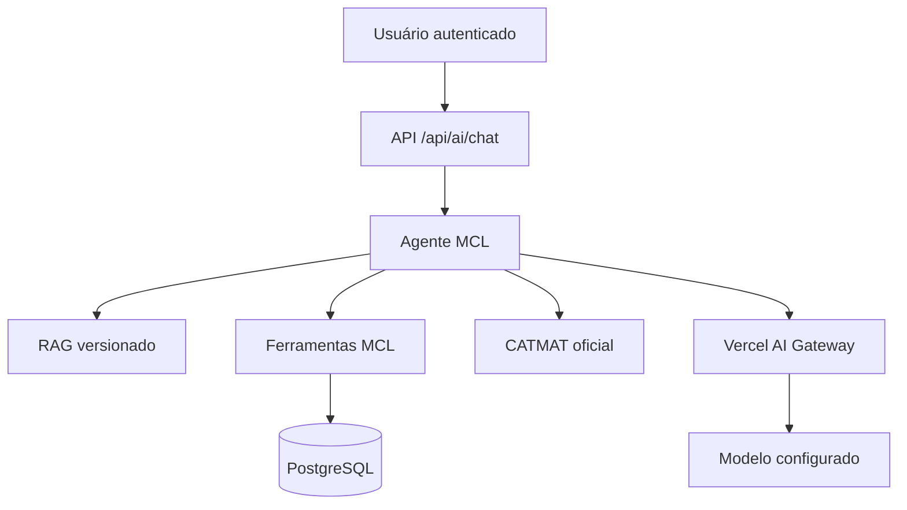

# Assistente IA — Gateway OIDC e RAG vivo

## Estado

Implementação inicial na branch `codex/assistente-rag-oidc`. O Assistente deixou de usar respostas fixas por palavra-chave e não consulta `DemoState`.

## Fluxo



- A rota exige sessão com organização e papéis locais.
- A primeira etapa do agente é obrigada a usar uma ferramenta.
- O agente tem no máximo 6 etapas, 1.200 tokens de saída e 30 segundos totais.
- O Gateway exige rota com zero retenção de dados, proíbe treinamento com o prompt e ordena provedores compatíveis por custo.
- A API aplica limite defensivo de 10 consultas por usuário/minuto e envia um identificador pseudonimizado para atribuição/quota no Gateway.
- Ferramentas são somente leitura, não aceitam SQL e aplicam o escopo organizacional no servidor.
- Objetos com origem `SIM-*`, organização/item sintético ou autoridade `DEMONSTRATIVO` são excluídos das consultas operacionais.
- Cada resultado devolve natureza, data de referência, fontes e lacunas.

## Autenticação do modelo

O caminho padrão usa o Vercel AI Gateway por identidade OIDC do projeto. No runtime atual, o SDK resolve essa identidade primeiro pelo contexto seguro da requisição (`x-vercel-oidc-token`) e também aceita `VERCEL_OIDC_TOKEN` como alternativa. A aplicação não inspeciona nem transporta esse token manualmente. Não há `AI_GATEWAY_API_KEY` no código nem em `.env.example`.

As duas configurações opcionais são não secretas:

```env
MCL_AI_PROVIDER=vercel-oidc
MCL_AI_MODEL=openai/gpt-5-mini
```

O SDK é a fonte de verdade para autenticação: a ausência de `process.env.VERCEL_OIDC_TOKEN` isoladamente não prova que OIDC está indisponível, pois o token pode existir no contexto da requisição. Se nenhum dos meios estiver disponível ou o Gateway recusar a identidade, a rota falha explicitamente com `AI_GATEWAY_AUTH_FAILED` e não retorna respostas fixas. Para desenvolvimento local vinculado à Vercel, a identidade temporária pode ser obtida pelo fluxo da CLI (`vercel env pull`); não deve ser commitada.

## RAG e ferramentas

O RAG local ranqueia trechos versionados sobre arquitetura, módulos, fontes e limitações. Ele explica a implementação; não substitui dados operacionais nem fonte jurídica oficial.

| Silo | Estado inicial | Regra |
|---|---|---|
| Arquitetura do MCL | Disponível | Recuperação lexical de trechos versionados |
| CATMAT | Disponível sob demanda | API oficial; falha/vazio permanecem explícitos |
| Necessidades | Condicional | PostgreSQL, RBAC e exclusão de sintéticos |
| Cobertura/ARPs | Condicional | Apenas necessidades operacionais autorizadas |
| Rastreabilidade | Condicional | Apenas locais e fontes operacionais autorizados |
| Divergências | Condicional | Apenas objetos operacionais no escopo |
| Conectores | Condicional | Registros simulados excluídos |
| Auditoria | Condicional e restrito | `ADMIN`, `AUDITOR` ou `LOGISTICS_MANAGER` |
| Créditos/TG | Bloqueado | Main atual contém dados fixos/derivados e carece de escopo organizacional seguro |
| SAG/Grupamento | Bloqueado | Snapshot validado permanece somente no `localStorage` |

“Condicional” significa que `DATABASE_URL` precisa estar configurada; a ausência do banco nunca ativa fallback em memória no Assistente.

## Contrato de resposta

A resposta JSON contém:

- texto gerado pelo agente;
- citações deduplicadas coletadas dos resultados das ferramentas;
- lacunas e exclusões;
- provedor, modelo e modo OIDC;
- identificador de rastro;
- consumo de tokens reportado pelo provedor.

Não existe mais `confidenceScore`. Uma porcentagem gerada pelo próprio sistema sem calibração não é evidência de confiança.

## Falhas esperadas

| Código | Significado |
|---|---|
| `AI_GATEWAY_AUTH_FAILED` | Gateway recusou a identidade do projeto |
| `AI_GATEWAY_BUDGET_EXHAUSTED` | Limite financeiro atingido |
| `AI_GATEWAY_RATE_LIMITED` | Limite temporário de requisições |
| `AI_GATEWAY_TIMEOUT` | Tempo total excedido |
| `AI_GATEWAY_UNAVAILABLE` | Gateway ou modelo indisponível |

Todas falham sem resposta substituta fabricada.

## Troca futura para a API direta da OpenAI

O ponto único de troca é `src/modules/ai/provider.ts`. Para migrar, deve-se:

1. instalar `@ai-sdk/openai`;
2. adicionar o ramo `openai-direct` no adaptador;
3. configurar a credencial da OpenAI somente no ambiente da Vercel;
4. preservar `agent.ts`, o RAG, as ferramentas, o RBAC e a interface;
5. repetir testes e comparar custo/latência/qualidade antes de promover.

Nenhuma ferramenta de dados deve conhecer o provedor do modelo.

## Critérios para liberar novos silos

Um novo silo só pode mudar para `AVAILABLE` quando tiver:

1. persistência server-side;
2. escopo organizacional ou regra de autorização verificável;
3. proveniência e data de atualização;
4. distinção de dados sintéticos;
5. consulta somente leitura coberta por teste;
6. ausência de fallback que invente registros.
