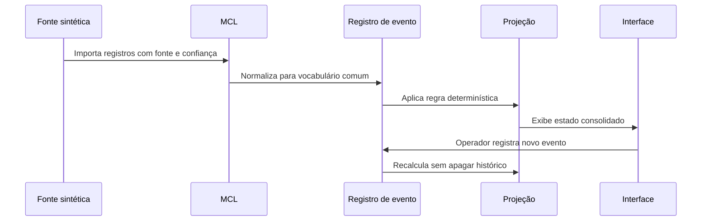

# Fluxo de Dados

```mermaid
sequenceDiagram
  participant Fonte as Fonte sintética
  participant MCL as MCL
  participant Evento as Registro de evento
  participant Proj as Projeção
  participant UI as Interface
  Fonte->>MCL: Importa registros com fonte e confiança
  MCL->>Evento: Normaliza para vocabulário comum
  Evento->>Proj: Aplica regra determinística
  Proj->>UI: Exibe estado consolidado
  UI->>Evento: Operador registra novo evento
  Evento->>Proj: Recalcula sem apagar histórico
```

Cada dado consolidado conserva fonte, identificador, ocorrência, registro, confiança, versão de esquema e natureza.
