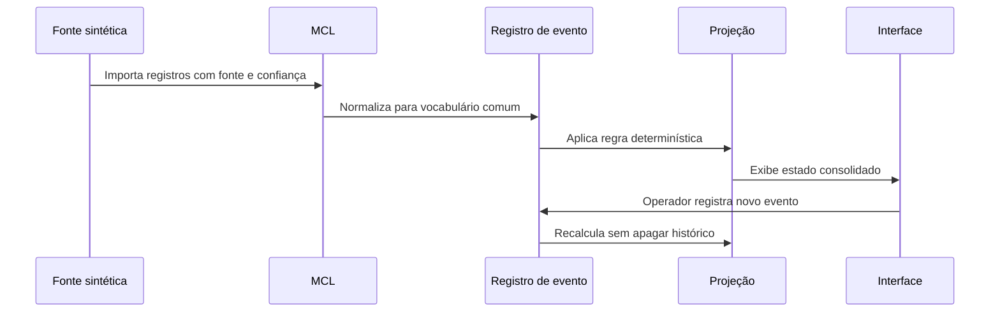
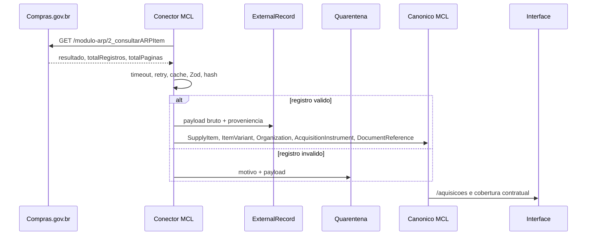

# Fluxo de Dados

Cada dado consolidado conserva fonte, identificador, ocorrência, registro, confiança, versão de esquema e natureza.

## Fluxo Compras.gov.br

O indicador de cobertura contratual usa apenas vinculos manuais `PODE_SER_ATENDIDA_POR` e nao e misturado com cobertura fisica sintetica.
