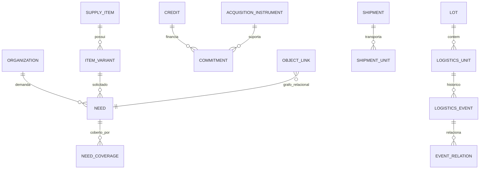

# Modelo de Domínio

```mermaid
erDiagram
  ORGANIZATION ||--o{ NEED : demanda
  SUPPLY_ITEM ||--o{ ITEM_VARIANT : possui
  ITEM_VARIANT ||--o{ NEED : solicitado
  NEED ||--o{ NEED_COVERAGE : coberto_por
  CREDIT ||--o{ COMMITMENT : financia
  ACQUISITION_INSTRUMENT ||--o{ COMMITMENT : suporta
  LOT ||--o{ LOGISTICS_UNIT : contem
  SHIPMENT ||--o{ SHIPMENT_UNIT : transporta
  LOGISTICS_UNIT ||--o{ LOGISTICS_EVENT : historico
  LOGISTICS_EVENT ||--o{ EVENT_RELATION : relaciona
  OBJECT_LINK }o--|| NEED : grafo_relacional
```

O grafo é representado por `ObjectLink` em PostgreSQL, sem banco de grafos na v0.1.0.
