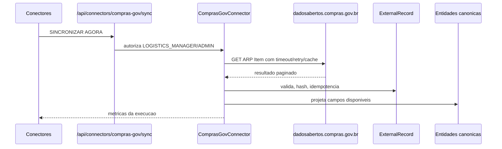

# Conector Compras.gov.br

Primeiro conector real do MCL, somente leitura, baseado na API publica oficial `https://dadosabertos.compras.gov.br`.

## Escopo

- Consulta `GET /modulo-arp/2_consultarARPItem`.
- Valida o envelope e cada item por Zod.
- Preserva payload bruto em `ExternalRecord`.
- Calcula hash SHA-256 do payload normalizado.
- Projeta dados aceitos para entidades canonicas minimas.
- Registra execucao em `ConnectorRun`.
- Atualiza saude do conector em `ConnectorHealth`.
- Registra auditoria para sincronizacao e falha.
- Mantem a aplicacao disponivel quando a API externa falha.

## Fluxo



## Configuracao

```env
COMPRAS_GOV_API_BASE_URL=https://dadosabertos.compras.gov.br
COMPRAS_GOV_SYNC_ENABLED=true
COMPRAS_GOV_PAGE_SIZE=10
COMPRAS_GOV_REQUEST_TIMEOUT_MS=12000
COMPRAS_GOV_CACHE_TTL_SECONDS=300
COMPRAS_GOV_UNIT_CODE=
COMPRAS_GOV_CATMAT_CODE=
COMPRAS_GOV_MODALITY_CODE=
COMPRAS_GOV_DATE_START=
COMPRAS_GOV_DATE_END=
COMPRAS_GOV_KEYWORD=
```

`COMPRAS_GOV_PAGE_SIZE` limita o processamento local; a API atual rejeitou `tamanhoPagina` em consultas testadas.

## Autorizacao

- Sincronizacao: `ADMIN` ou `LOGISTICS_MANAGER`.
- Vinculo manual necessidade/instrumento: `ADMIN` ou `LOGISTICS_MANAGER`.

## Staging

Cada `ExternalRecord` preserva:

- `connectorId`
- `externalType`
- `externalId`
- `sourceUrl`
- `fetchedAt`
- `sourceUpdatedAt`
- `schemaVersion`
- `payload`
- `payloadHash`
- `processingStatus`
- `errorMessage`

## Observacao sobre banco

O Prisma ja contem os modelos para PostgreSQL, mas o runtime atual usa store em memoria ate `DATABASE_URL` e migracoes estarem configuradas.
