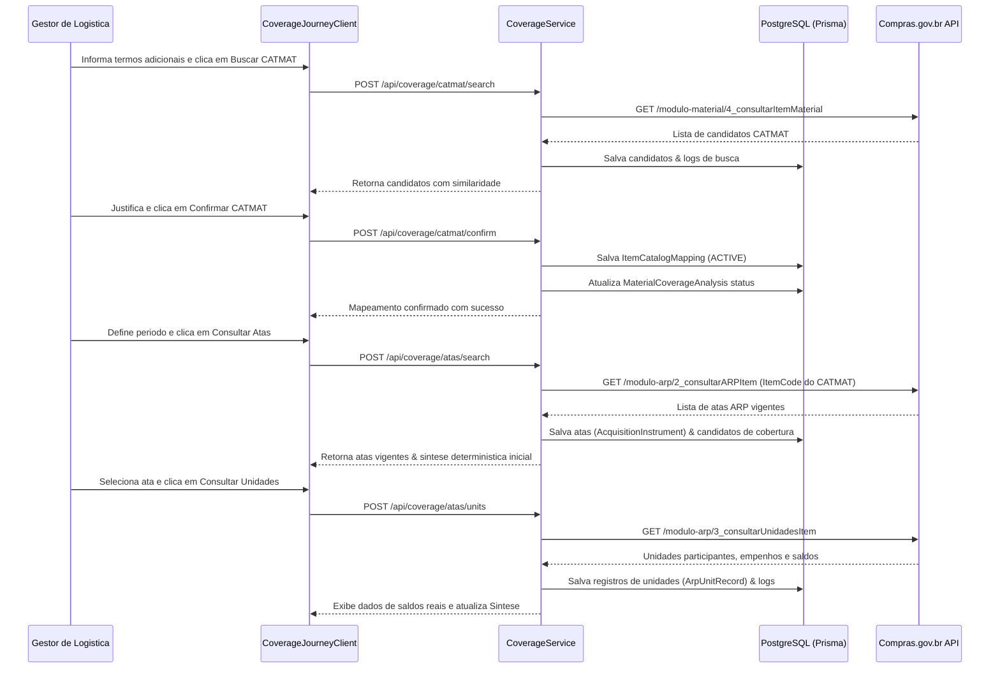

# Fluxo de Dados - Análise de Cobertura de Materiais

Este documento apresenta como os dados circulam pelos componentes, endpoints da API externa e banco de dados local.

```mermaid
sequenceDiagram
    participant User as Gestor de Logistica
    participant UI as CoverageJourneyClient
    participant Service as CoverageService
    participant DB as PostgreSQL (Prisma)
    participant Gov as Compras.gov.br API

    User->>UI: Informa termos adicionais e clica em Buscar CATMAT
    UI->>Service: POST /api/coverage/catmat/search
    Service->>Gov: GET /modulo-material/4_consultarItemMaterial
    Gov-->>Service: Lista de candidatos CATMAT
    Service->>DB: Salva candidatos & logs de busca
    Service-->>UI: Retorna candidatos com similaridade
    User->>UI: Justifica e clica em Confirmar CATMAT
    UI->>Service: POST /api/coverage/catmat/confirm
    Service->>DB: Salva ItemCatalogMapping (ACTIVE)
    Service->>DB: Atualiza MaterialCoverageAnalysis status
    Service-->>UI: Mapeamento confirmado com sucesso
    User->>UI: Define periodo e clica em Consultar Atas
    UI->>Service: POST /api/coverage/atas/search
    Service->>Gov: GET /modulo-arp/2_consultarARPItem (ItemCode do CATMAT)
    Gov-->>Service: Lista de atas ARP vigentes
    Service->>DB: Salva atas (AcquisitionInstrument) & candidatos de cobertura
    Service-->>UI: Retorna atas vigentes & sintese deterministica inicial
    User->>UI: Seleciona ata e clica em Consultar Unidades
    UI->>Service: POST /api/coverage/atas/units
    Service->>Gov: GET /modulo-arp/3_consultarUnidadesItem
    Gov-->>Service: Unidades participantes, empenhos e saldos
    Service->>DB: Salva registros de unidades (ArpUnitRecord) & logs
    Service-->>UI: Exibe dados de saldos reais e atualiza Sintese
```
